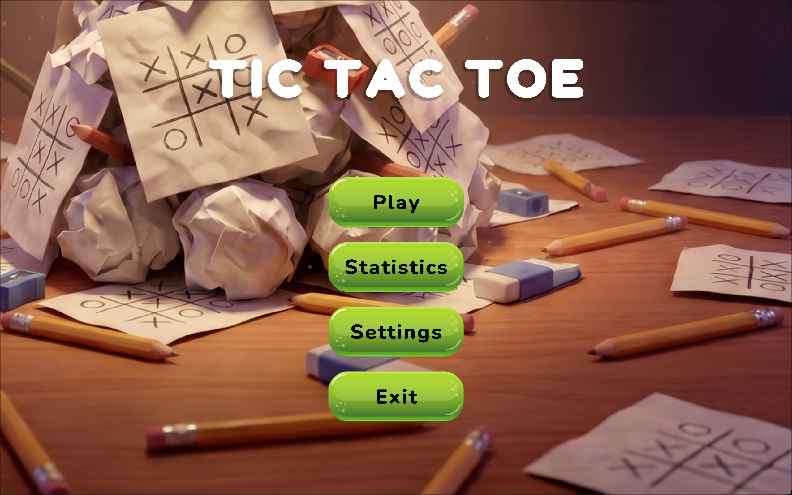
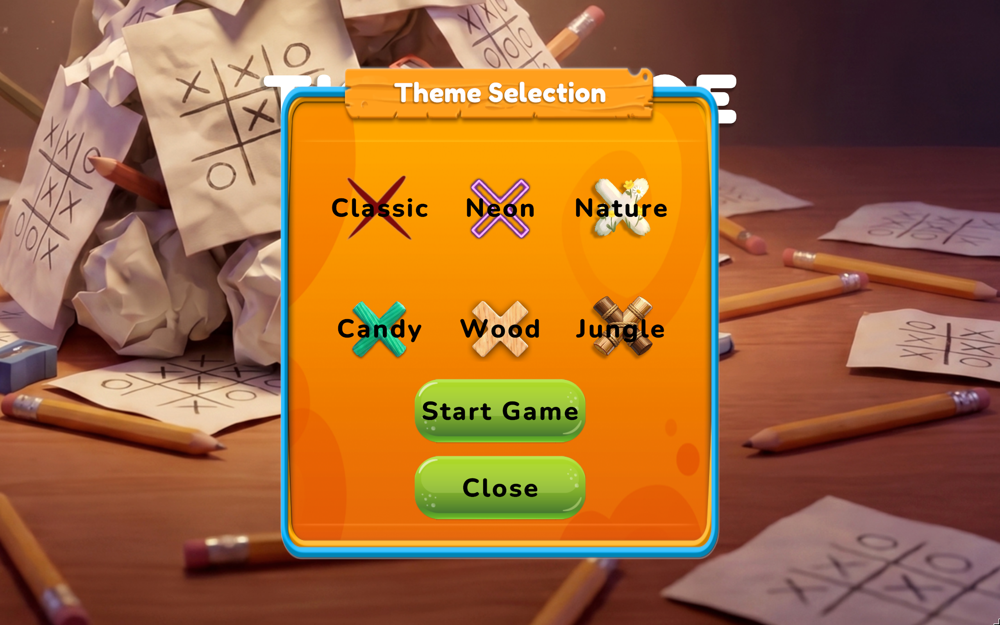
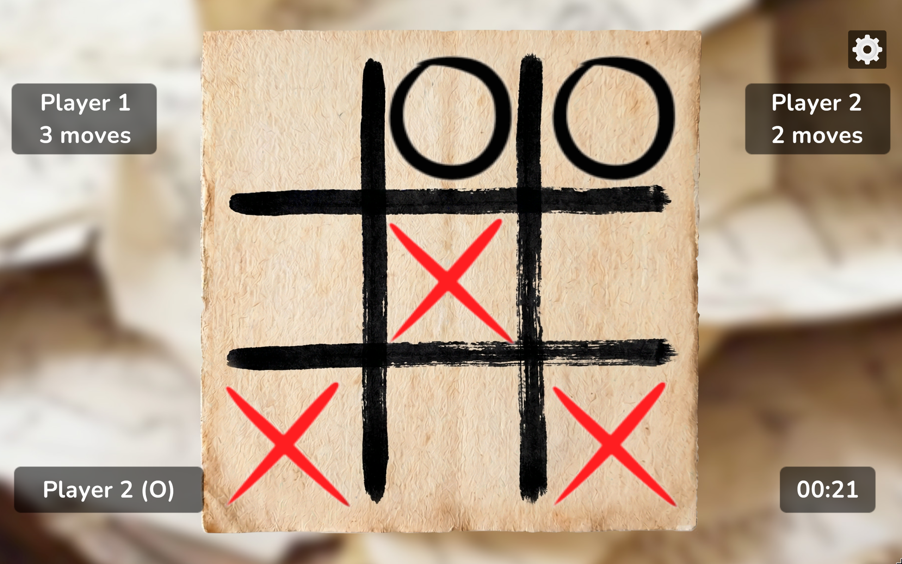
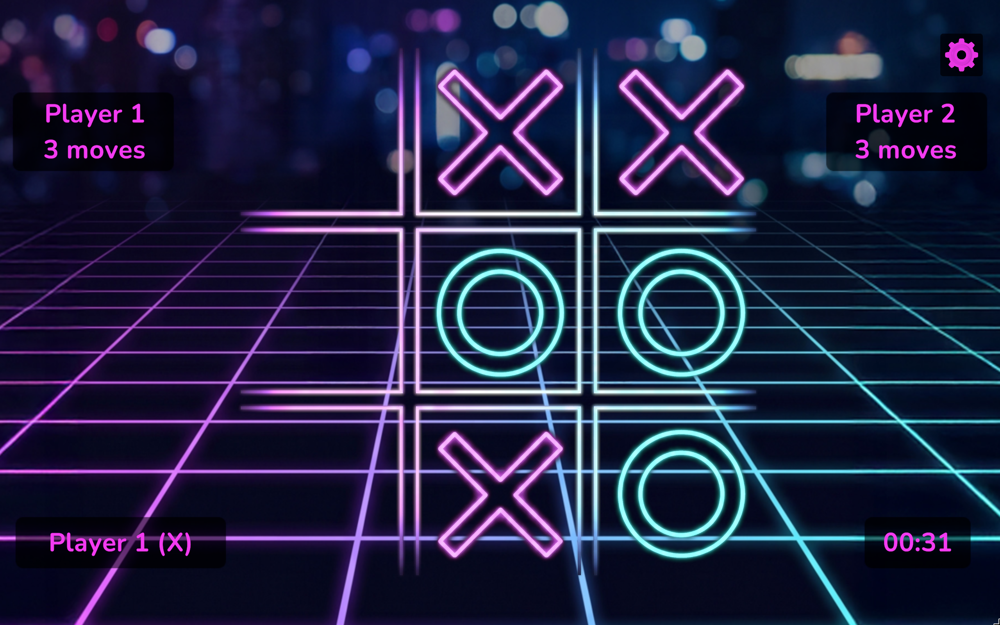
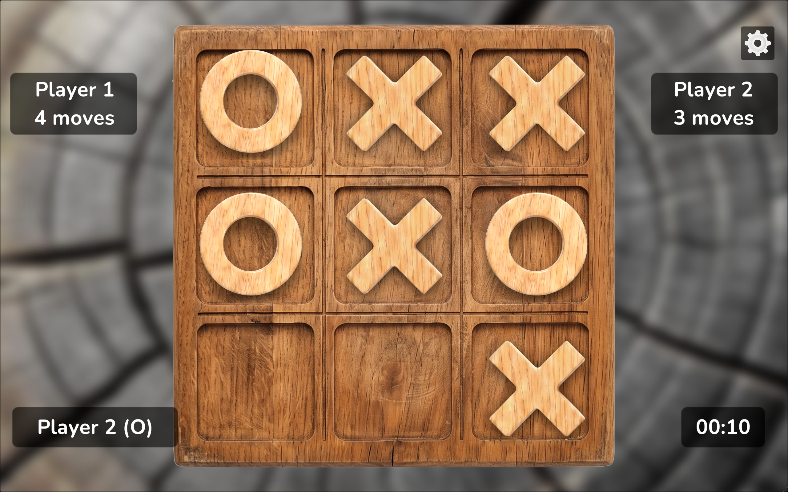
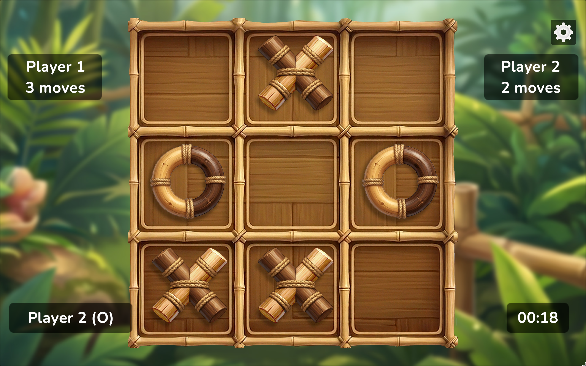
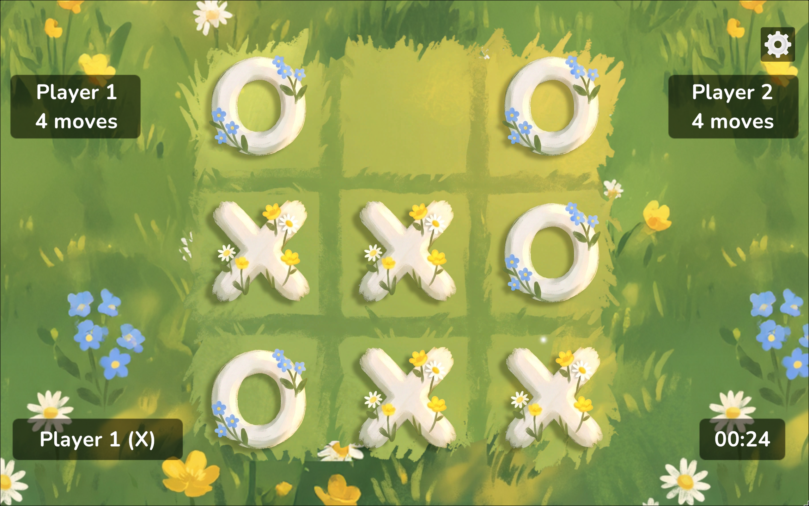
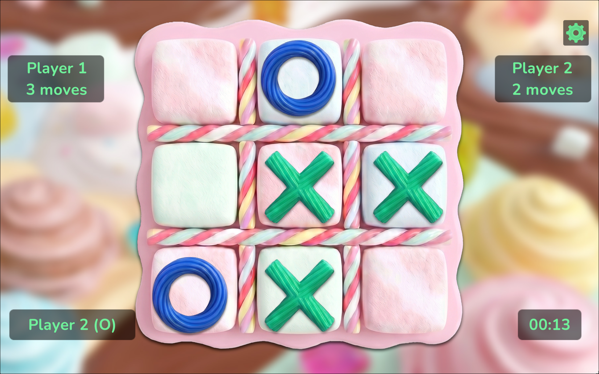

# TicTacToe

Local multiplayer Tic-Tac-Toe built in Unity 6.

**Play it:** [marko-builds.itch.io/tictactoe](https://marko-builds.itch.io/tictactoe)


---

## Screenshots

| Main menu | Theme selection |
|:---:|:---:|
|  |  |

**Six themes, one ScriptableObject each:**

| Classic | Neon | Wood |
|:---:|:---:|:---:|
|  |  |  |
| **Jungle** | **Nature** | **Candy** |
|  |  |  |

---

## How to Run

**In the editor:**

- Unity 6 (6000.4.3f1)
- Open `Assets/_Project/Scenes/PlayScene.unity`
- Press Play. Always start from PlayScene.

---

## Features

- Local multiplayer: two players, one device
- 6 selectable themes with distinct visuals for board, backgrounds and X/O buttons
- Persistent statistics across sessions: total games, wins per player, draws, average duration
- Persistent audio settings: BGM and SFX toggles saved between sessions
- Portrait and landscape orientation support
- Win detection with animated strike line
- Match timer and per-player move count in the HUD

---

## Architecture

The project is built around three principles that surface throughout the code: **single responsibility**, **event-driven communication**, and **open/closed extensibility**.

### Event system

All game-wide communication uses C# static events on manager classes rather than UnityEvents or direct method calls. `GameManager` owns the event declarations (`OnGameStateChanged`, `OnMarkPlaced`, `OnGameOver`, `OnTurnChanged`) and fires them. UI, audio, and persistence systems subscribe and react without any coupling to each other or to game logic. Subscribing always happens in `OnEnable` with a matching unsubscription in `OnDisable`, preventing memory leaks that are particularly costly on mobile.

### Win condition checker

`WinConditionChecker` is a static class with no `MonoBehaviour` dependency. It takes a `PlayerMark[]` board array and returns a `WinResult`.

### Theme system: interface segregation

The theme system is built around five small interfaces rather than one large `ITheme`:

```
ITheme       identity: ThemeId, DisplayName
IThemeBoard  board background, cell sprites/colors, marks, player colors
IThemeUI     scene background, button sprites, popup backgrounds, text colors
IThemeHUD    HUD text color, player indicator color, strike line color
IThemeAudio  BGM clip per theme
```

`ThemeSO` implements all five. Each system only depends on the interface it needs. `BoardController` takes `IThemeBoard` and has zero knowledge of button sprites. `PopupBase` takes `IThemeUI` and has zero knowledge of board colors. Adding a seventh theme requires creating one new `ScriptableObject` asset, with no code changes anywhere.

### JSON persistence

All persistence goes through `SaveSystem`, a static class that reads and writes JSON to `Application.persistentDataPath`. `SaveManager` owns the live data objects (`StatsData`, `GameSettings`) and exposes events when data changes. No `PlayerPrefs` are used anywhere. This means the full save state is inspectable as a plain text file during debugging, the data model is properly typed, and the pattern scales to any data structure without workarounds.

### Popup system

All five popups inherit from `PopupBase`, which handles open/close animation triggers, audio, and lifecycle through `PopupManager`'s stack. Opening a popup pushes it onto the stack. Closing pops it. No popup can accidentally close another or get stuck open. Adding a new popup requires extending `PopupBase` and registering with `PopupManager`. Existing popups are untouched.

---

## What I Would Improve With More Time

**VFX on cell placement.** The current particle system fires on win. A smaller burst on every mark placement, scaled to the player's theme color, would make the game feel significantly more tactile.

**Per-theme SFX variation.** BGM switches per theme but SFX does not. Distinct placement and win sounds per theme would complete the audio identity of each theme.

---

## Project Structure

```
Assets/_Project/
  Audio/          BGM and SFX clips
  Fonts/          TMP font assets
  Prefabs/
    Popups/       five popup prefabs
  Scenes/
    PlayScene     main menu, theme selection, stats
    GameScene     board, HUD, game result
  Scripts/
    Core/         GameManager, AudioManager, SaveSystem,
                  SaveManager, ThemeManager, PopupManager
    Data/         StatsData, GameSettings, ThemeSO, enums
    Gameplay/     BoardController, CellView, WinConditionChecker,
                  TurnManager, GameTimer, StrikeAnimator
    Interfaces/   ITheme, IThemeBoard, IThemeUI, IThemeHUD, IThemeAudio,
                  ISaveable, IPopup
    UI/           MainMenuController, GameHUDController, all popups,
                  ButtonThemeApplier, HUDThemeApplier,
                  SceneBackgroundController
    Utils/        SceneNames, AnimatorParams, LocalisationKeys
  Sprites/
    Themes/       six theme sprite sets
  Themes/         six ThemeSO assets
```

---

## Stack

- Unity 6 (6000.4.3f1)
- C# / .NET Standard 2.1
- uGUI
- TextMeshPro
- Android IL2CPP, ARM64 + ARMv7, API 24+

---

## License

[MIT](LICENSE) © 2026 Marko Stankovic
